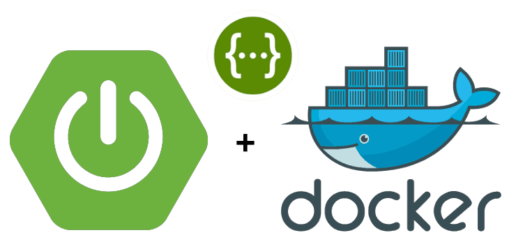

# Running-Information-Analysis-Service REST API
This REST API is designing and collaborating with the Runner Tracking Application. The API is used for tracking a specific runner's running information such as their running distance, duration, heart rate, location (lat/long) etc..  

[](https://www.codacy.com/app/slam9z/CS504-Homework-1?utm_source=github.com&amp;utm_medium=referral&amp;utm_content=slam9z/CS504-Homework-1&amp;utm_campaign=Badge_Grade)

## Requirements
* Please check the [Requirement.md](./Project_Log/Requirement.md) for more detail 
##### Features Summary
* Add one or more Running Information  
* Delete By RunningId
* List all the running information by Health Warning Level, but not limit to other filter categories.
* Basic Data Validation for fields:
    1. TotalRunning: should be positive number
    2. RunningDistance: should be positive number
    3. RunningId: should be a valid UUID/GUID format

#### Development:

- Language: Java 1.8
- Framework: SpringBoot
    * Spring Data JPA
    * Spring Data Rest
- Database: MySQL
- Container Engine: Docker
- Build Tool: Maven
- Server Port: 9000

## Getting started

#### Clone the repository
```Bash
$ git clone https://github.com/slam9z/CS504-Homework-1.git
```
#### Get into the project folder
```Bash
cd CS504-Homework-1
```

#### Start MySQL Docker
```Bash
docker-compose up -d
```
#### Login database and query data
 ```Bash
mysql --host=127.0.0.1 --port=3306 --user=root --password=root
 
mysql> show databases; 
mysql> use running_information_analysis_db;
mysql> select * from private;
 
 ```
#### Create Database - if not existed
```Bash
sh run_DB_CS504_Homework_1.sh
```

#### Install the project dependencies
```Bash
cd CS504-Homework-1
mvn clean install
```

#### Run the application 
```Bash
mvn spring-boot:run
```

#### Run with Postman
```
#Open browser and enter 

http://localhost:9000/api/runningInformations/add    copy and paste the json file in Response Body

http://localhost:9000/api/runningInformations/deleteByRunningId/{runningId}

http://localhost:9000/api/runningInformations/purge

http://localhost:9000/api/runningInformations/listedBy

http://localhost:9000/api/runningInformations/listedBy?page=0&size=3

http://localhost:9000/api/runningInformations/id/{id}
```

#### Run without Postman:
```
#Navigate to project directory
cd CS504-Homework-1

#help command
sh run_CS504_Homework_1.sh -h

#add bulk of runninginformation by JSON input: running-information-data.json
sh run_CS504_Homework_1.sh -c 

#list all the running information
sh run_CS504_Homework_1.sh -ls

#list all the running information by page,size,sort
sh run_CS504_Homework_1.sh -ls --page 1 --size 3 --sortBy runningId --sortDir ASC

#list by id
sh run_CS504_Homework_1.sh -f <id>

#delete by runningId
sh run_CS504_Homework_1.sh -d <runningId>

#delete all
sh run_CS504_Homework_1.sh -p

```


